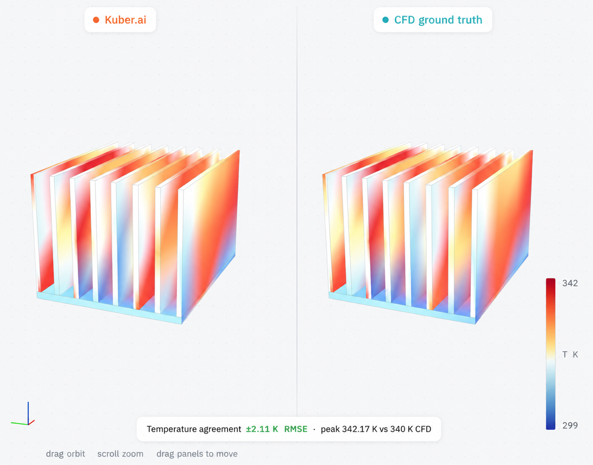
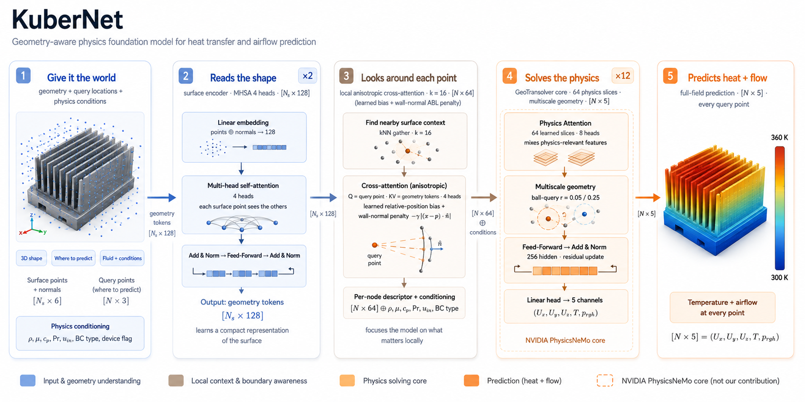

<div align="center">

# Kuber

**An open framework for conjugate-heat-transfer AI** - build, train, and operate geometry-general neural surrogates for coupled fluid-heat problems (datacenters, CPUs/GPUs, heatsinks, cold plates, heat exchangers, power electronics, battery packs). First results: **electronics cooling**, where Kuber beats the previous best on the SIMSHIFT heatsink benchmark with **no domain adaptation**.

[](https://shubhoo7-kuber-live.hf.space/)
[](paper/kuber.pdf)
[](https://colab.research.google.com/github/Kuber-research/Kuber_Thermal/blob/main/notebooks/quickstart.ipynb)
[](https://github.com/Kuber-research/Kuber_Thermal/actions/workflows/tests.yml)
[](LICENSE)

</div>

| Kuber prediction vs. CFD ground truth | |
|:---:|:---:|
|  |  |
| **Heatsink** - ±2.11 K, **7,000× faster** than CFD | **Cold plate** - ±1.33 K, **445× faster** than CFD |

**[Read the paper (PDF)](paper/kuber.pdf)** · [Project page](https://kuber-research.github.io/Kuber_Thermal/) · [Live demo](https://shubhoo7-kuber-live.hf.space/)

## Highlights

- **Geometry-general.** KuberNet reads raw boundary geometry (surface point cloud + normals) and predicts the full field `(Uₓ, U_y, U_z, T, p_rgh)` at any query point - no analytic SDF, works on arbitrary CAD. Its *anisotropic boundary-layer* (ABL) cross-attention biases attention along the wall.
- **State of the art, no UDA.** **11.84 K** temperature RMSE on the SIMSHIFT heatsink OOD split, beating the prior best (UPT, 12.41 K) - while every baseline relies on unsupervised domain adaptation and Kuber uses none.
- **One model, many device classes.** Heatsinks and cold plates from a single set of weights, distinguished only by a device flag + physics conditioning.
- **Reproducible data engine.** Parametric geometry → OpenFOAM `buoyantSimpleFoam` → per-node `.npz`; resumable, convergence-gated, mesh-verified, license-clean (0 external cases).
- **Up to 10,000× faster than CFD**, sub-second and geometry-independent.



## Install

```bash
git clone https://github.com/Kuber-research/Kuber_Thermal.git && cd Kuber_Thermal
python -m venv .venv && source .venv/bin/activate
pip install -r requirements.txt
```

The model core is **GeoTransolver** from [NVIDIA PhysicsNeMo](https://github.com/NVIDIA/physicsnemo). Data generation additionally needs [OpenFOAM](https://www.openfoam.com/) v2306+ on `PATH` (the model, eval, and data sample work without it). Tested versions in [`requirements.txt`](requirements.txt); details in [Supported systems](#supported-systems).

## Quickstart

**No install:** [Colab notebook](https://colab.research.google.com/github/Kuber-research/Kuber_Thermal/blob/main/notebooks/quickstart.ipynb) loads a real CHT case on CPU.

```bash
# Peek at a sample case (no OpenFOAM/GPU needed)
python -c "import numpy as np, os; d=np.load('data_sample/'+sorted(os.listdir('data_sample'))[0]); print({k:getattr(d[k],'shape',None) for k in d.files})"

# Evaluate a checkpoint (geometry mode + conditioning read from it)
python -m kuber.train_simshift --eval_only <model.pt> --data <npz_dir> --splits <splits.json> --difficulty medium

# Train the production model
python -m kuber.train_simshift --data <npz_dir> --splits <splits.json> --difficulty medium --geom_mode surface
```

## Recipes

| Task | Command |
|---|---|
| **Train** | `python -m kuber.train_simshift --data <d> --splits <s> --difficulty medium --geom_mode surface` |
| **Evaluate** (in-dist + OOD) | `python -m kuber.train_simshift --eval_only <model.pt> --data <d> --splits <s> --difficulty medium` |
| **Pretrain → fine-tune** | `... --geom_mode surface --drop_geom_scalars --init_from pretrain/<ckpt>` |
| **Stability proof** | `python -m kuber.edge_proof --ckpt <model.pt> --data <d> --splits <s> --difficulty medium` |
| **Generate data** (OpenFOAM) | `python datagen/run_sweep_bsf.py --cases <cases> --out <corpus> --scripts <scripts>` |
| **Rebuild figures** | `python assets/make_figures.py` |

`--geom_mode {none,sdf,dsdf,surface}` picks the geometry representation (`surface` = production); `--refine` adds the PDE-Refiner head. See `--help` for all flags.

## Dataset & Training

A **self-generated OpenFOAM CHT corpus** for electronics cooling - **0 cases from SIMSHIFT or any licensed source**. Each case: one steady field sampled to a 16,384-node fluid cloud + 2,048-point surface cloud, across two device classes (heatsinks, cold plates), four fluids (air/water/oil/glycol), natural and forced convection. Built by a parametric generator → mesh (`snappyHexMesh`/`blockMesh` + prism layers) → `buoyantSimpleFoam` → `.npz`, resumable and convergence-gated. Format, coverage, and the mesh-convergence study: **[`docs/DATASET.md`](docs/DATASET.md)**.

One **KuberNet** (~14.3 M params) trains across both classes with geometry read *only* from the surface cloud, under a unified physics-conditioning vector; targets z-scored on the training split (no leakage); Adam + Warmup-Stable-Decay; **no UDA**. Full recipe: **[`docs/TRAINING.md`](docs/TRAINING.md)**.

## Benchmarks

**SIMSHIFT heatsink, medium / OOD split** (train fins 5–8 → test 10–12). Baselines include UDA; Kuber uses none. Lower is better. Full metrics + caveats: [`docs/RESULTS.md`](docs/RESULTS.md).

| model | UDA | Temp RMSE (K) ↓ | Velocity RMSE (m/s) ↓ | params |
|---|:---:|:---:|:---:|:---:|
| **Kuber - KuberNet (ABL)** | ✗ | **11.84** | 0.044 | 14.3 M |
| UPT *(prev. best)* | ✓ | 12.41 | 0.039 | ~14 M |
| Transolver | ✓ | 13.43 | 0.041 | ~14 M |
| PointNet | ✓ | 17.43 | 0.044 | ~14 M |


The lead number is **zero-shot** (test fin counts never seen in training); predicted ∇T stays at or below physical everywhere (explosion fraction 0, no NaN/Inf). Pretraining on the corpus lowers error further - a physics prior, not test-set exposure ([why it isn't leakage](docs/RESULTS.md)).

**One model, two device classes** (held-out per class on our corpus; not comparable to SIMSHIFT above):

| held-out class | Temp RMSE (K) ↓ | mean nRMSE ↓ |
|---|:---:|:---:|
| cold plates | 3.11 | 0.028 |
| heatsinks | 5.13 | 0.145 |
| in-distribution (both) | 1.72 | 0.027 |

## Roadmap

An open **suite**, not a finished benchmark - each milestone gated on a verifiable outcome.

- **M1 · Production-ready on real CAD** - generalize beyond parametric families to as-supplied geometry; grow the corpus past its air-dominated mix; measured scaling laws (OOD error vs corpus/params/diversity); a graded, magnitude-measured distribution-shift protocol; released checkpoints + per-GPU timings.
- **M2 · Trustworthy to design against** - calibrated per-node uncertainty (from the PDE-Refiner ensemble); cold-plate topologies (serpentine, pin-fin); more device classes; active learning.
- **M3 · From predictor to design tool** - CAD connectors (STEP/IGES/STL), agentic geometry optimization (propose → predict → score → refine), hosted inference + ONNX/TensorRT, a sealed-test leaderboard.

Details in the [paper](paper/kuber.pdf). Contributions welcome.

## Contributing

Rigor is welcome - new baselines, harder splits, better data, or caught over-claims. Ground rules: no licensed/scraped data, full reproducibility (exact command + environment), honest disclosure of UDA and external pretraining. See [`CONTRIBUTING.md`](CONTRIBUTING.md).

## Supported systems

- **OS:** Linux (tested). **Python:** 3.10+. Pinned: `torch==2.12.1`, `numpy==2.4.6`, `nvidia-physicsnemo==2.1.1`.
- **Hardware:** CUDA GPU recommended for training (required for the multiscale ball-query core); eval + data sample run on CPU.
- **Data generation** (optional): OpenFOAM v2306+ with `buoyantSimpleFoam`, `blockMesh`, `snappyHexMesh` on `PATH`.

## Licensing

**[PolyForm Noncommercial 1.0.0](LICENSE)** - free for research, education, and evaluation. Commercial use requires a separate license (contact the Kuber.ai team). The GeoTransolver core is a dependency from NVIDIA PhysicsNeMo (Apache-2.0).

## Acknowledgements & citing

Builds on **GeoTransolver / PhysicsNeMo** (NVIDIA); draws on **Transolver**, **AB-UPT**, **SIMSHIFT**, **PDE-Refiner**, and **OpenFOAM**. Full references in [`docs/MODEL.md`](docs/MODEL.md) and the [paper](paper/kuber.pdf).

```bibtex
@techreport{kubernet2026,
  title       = {KuberNet: A Geometry-General Surrogate for Conjugate Heat Transfer with Boundary-Layer Attention},
  author      = {Jain, Shubh and Agarwal, Hardik},
  institution = {Kuber.ai},
  year        = {2026},
  url         = {https://github.com/Kuber-research/Kuber_Thermal}
}
```
