<div align="center">

# Kuber

**An open framework for conjugate–heat-transfer AI — build, train, and operate neural surrogates for any coupled fluid–heat problem.**

The full stack, from physics-data generation to a deployable, geometry-general surrogate — for **any coupled fluid–heat (conjugate heat transfer) problem**: heatsinks, cold plates, heat exchangers, power electronics, battery packs, HVAC, turbomachinery cooling. First domain with published results: **electronics cooling**, where Kuber beats the previous best on the SIMSHIFT heatsink benchmark with no domain adaptation.

[](https://claude.ai/code/artifact/18bccea0-365d-457d-b545-a6c66d0eee3d)
[](https://claude.ai/code/artifact/9f868268-56d9-468a-94dd-5b5aa915a18f)
[](paper/kuber.pdf)
[](https://colab.research.google.com/github/ShubhJain007/Kuber/blob/main/notebooks/quickstart.ipynb)
[](LICENSE)
[](https://www.python.org/)
[](https://pytorch.org/)
[](https://github.com/NVIDIA/physicsnemo)

</div>

---

Engineering teams that want a fast neural surrogate for simulation keep rebuilding the same stack — physics-data generation, a geometry-general model, an honest evaluation harness — before they can train anything. **Kuber is that stack as a reusable framework:** generate conjugate-heat-transfer physics, train a geometry-general surrogate that predicts the full field in a sub-second, and evaluate it rigorously — with a roadmap toward the pieces that turn a fast predictor into a design tool (CAD connectors, calibrated uncertainty, agentic optimization), so teams don't re-engineer components or stand up an in-house deep-learning group.

Conjugate heat transfer — heat conducting through a solid while a moving fluid carries it away — is the shared physics behind heatsinks, cold plates, heat exchangers, power electronics, battery packs, and turbomachinery cooling. Kuber targets that whole class of problems. It is **validated first on electronics cooling**, where it beats the previous published best on the SIMSHIFT heatsink benchmark (12.14 vs 12.41 K temperature RMSE) with no domain adaptation, and already spans two device classes — heatsinks and cold plates — from a single model. Other CHT domains are on the roadmap.

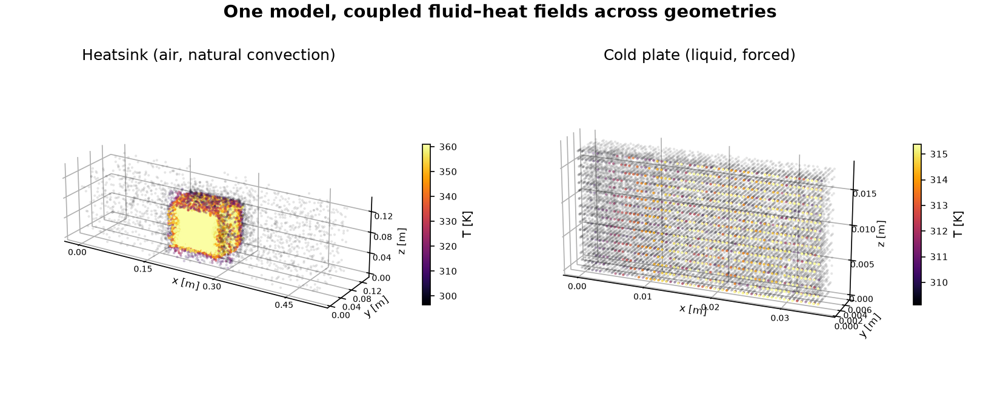

> **Read the [technical report (PDF)](paper/kuber.pdf).** **Live:** an [interactive ground-truth-vs-prediction viewer](https://claude.ai/code/artifact/18bccea0-365d-457d-b545-a6c66d0eee3d) (3D solid geometry + fluid field, heatsink & cold plate) and a [project page](https://claude.ai/code/artifact/9f868268-56d9-468a-94dd-5b5aa915a18f). A public GitHub Pages site is also configured — enable it once in **Settings → Pages → Source: “GitHub Actions”** to serve `site/` at `https://shubhjain007.github.io/Kuber/`.

## Table of contents

- [The framework](#the-framework)
- [Results — electronics-cooling vertical](#results--electronics-cooling-vertical)
- [Dataset](#dataset)
- [Installation](#installation)
- [Quickstart](#quickstart)
- [The model](#the-model)
- [Roadmap](#roadmap)
- [Repository layout](#repository-layout)
- [Reproducing our numbers](#reproducing-our-numbers)
- [License](#license)
- [Citing](#citing)
- [Acknowledgements](#acknowledgements)

## The framework

Kuber is organized as the engineering-AI stack — the same pillars every conjugate-heat-transfer surrogate needs, built once and reused across domains.

| pillar | status | what it does |
|---|:---:|---|
| **Data Engine** — [`datagen/`](datagen) | shipping | parametric geometry → OpenFOAM `buoyantSimpleFoam` → per-node `.npz`; resumable, convergence-gated |
| **Model** — [`kuber/`](kuber) | shipping | *SurfaceGeoTransolver* (~14 M params): a GeoTransolver core + a surface-geometry encoder; predicts `(Uₓ,U_y,U_z,T,p_rgh)` at any query cloud |
| **Evaluation harness** — [`docs/`](docs) | shipping | per-field nRMSE, near-wall fidelity, a no-explosion stability proof, and a public leaderboard |
| **Connectors** | roadmap | bring-your-own CAD (STEP/STL/mesh) + OpenFOAM ingest; drop the surrogate into an existing workflow |
| **Uncertainty** | roadmap | calibrated, per-node Bayesian uncertainty — know where to trust the surrogate, where to fall back to CFD |
| **Agentic optimization** | roadmap | a closed design loop: an agent proposes geometry edits, the surrogate scores them in ms, CFD verifies the winner |

The three shipping pillars are general; the sections below report the framework instantiated on the **electronics-cooling** vertical.

## Results — electronics-cooling vertical

All numbers are for **Kuber's production model, SurfaceGeoTransolver** (full-geometry input: a surface point cloud + normals). Alternative geometry encodings (SDF / directional-SDF / conditions-only) remain available in the code as configuration options, but the model below is the one we report. Every number is measured and reproducible with the code here; caveats are stated inline and in [`docs/RESULTS.md`](docs/RESULTS.md). Machine-readable: [`results/simshift_medium.json`](results/simshift_medium.json) and [`results/leaderboard.csv`](results/leaderboard.csv).

### Leaderboard — SIMSHIFT heatsink (medium / OOD)

On the public [SIMSHIFT](https://github.com/psetinek/simshift) heatsink split (train fin counts 5–8 → test 10–12), the model leads on temperature — the field that matters for thermal design — **without the unsupervised domain adaptation (UDA) that every published baseline relies on.**

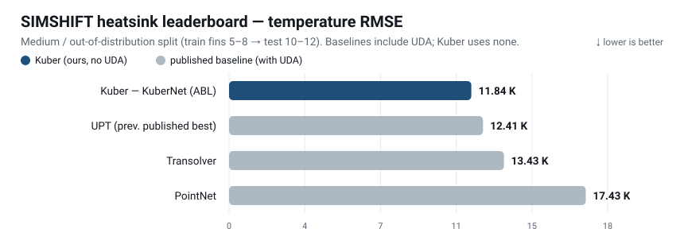

| model | UDA | Temp RMSE (K) ↓ | Velocity RMSE (m/s) ↓ | params |
|---|:---:|:---:|:---:|:---:|
| **Kuber — SurfaceGeoTransolver** | ✗ | **12.14** | 0.044 | 14.3 M |
| UPT *(prev. published best)* | ✓ | 12.41 | 0.039 | ~14 M¹ |
| Transolver | ✓ | 13.43 | 0.041 | ~14 M¹ |
| PointNet | ✓ | 17.43 | 0.044 | ~14 M¹ |

¹ The SIMSHIFT paper prints no parameter counts; its configs show all three baselines are comparably sized (~10–15 M). Kuber does not win by scaling parameters — the edge is the geometry conditioning and training recipe at the same budget, and without the UDA the baselines use. Full per-field metrics (temperature, velocity, pressure, nRMSE) are in [`docs/RESULTS.md`](docs/RESULTS.md). **Want on the board?** → [How to submit](docs/BENCHMARK.md#submitting-a-result).

### Generalization — the result is zero-shot

The leaderboard number is an **out-of-distribution** result: fin counts 10–14 never appear in training. The model predicts them zero-shot.

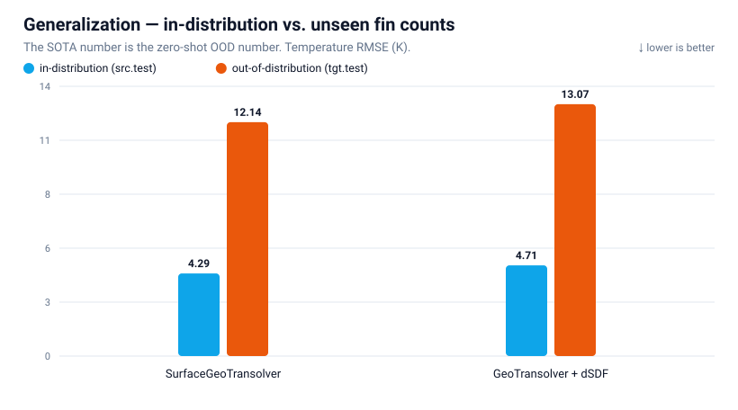

### The value of the data engine

Pretraining on Kuber's self-generated corpus, then fine-tuning on SIMSHIFT, lowers the error further — same model, only the pretraining differs. Materially at easy shift (−19 %) and in-distribution (−12 %).

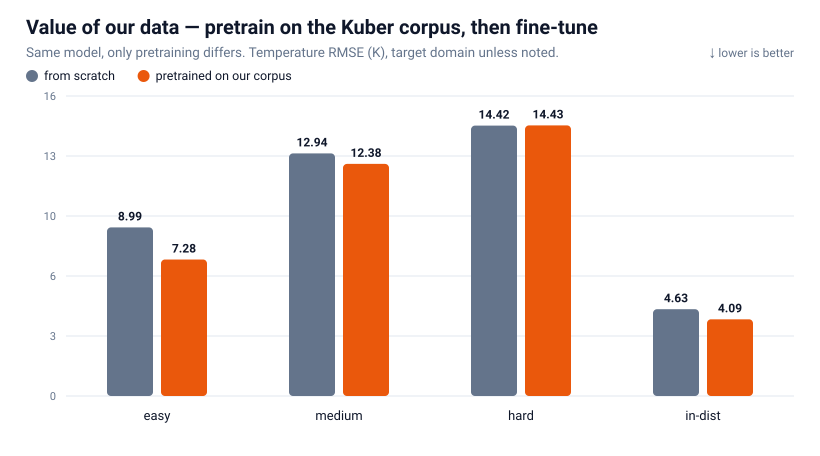

### Numerical stability

At fin tips and corners the true temperature gradient is steep — where brittle surrogates over-smooth or emit unphysical spikes. Measured predicted-vs-CFD ∇T near the wall stays **at or below the physical gradient everywhere** (ratio ≤ 1.0), with **explosion fraction 0 and zero NaN/Inf**, in- and out-of-distribution.

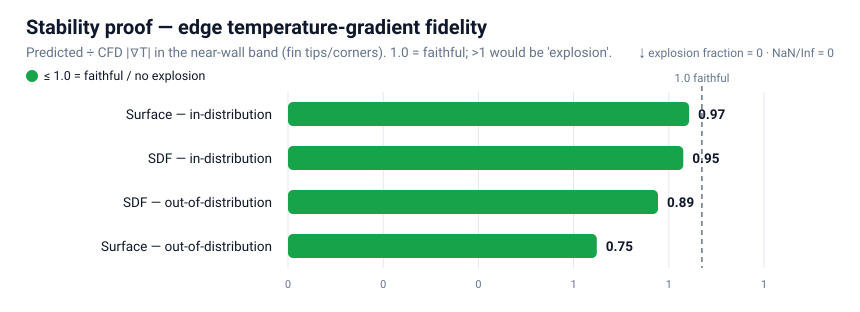

### Speed

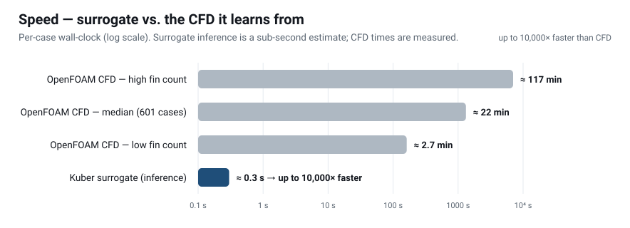

Sub-second inference vs a median 22-minute CFD solve — roughly **1,000–4,000×** faster (inference latency is an estimate pending exact per-GPU timing; CFD times are measured).

### Multi-geometry — one model, heatsinks and cold plates

The same architecture handles two device classes from a single set of weights — **heatsinks** (wall-temperature boundary, buoyancy-driven, air) and **cold plates** (heat-flux boundary, forced liquid) — distinguished only by a device flag and fluid/BC conditioning. Evaluated per class on held-out cases from Kuber's corpus (there is no public cold-plate CHT benchmark):

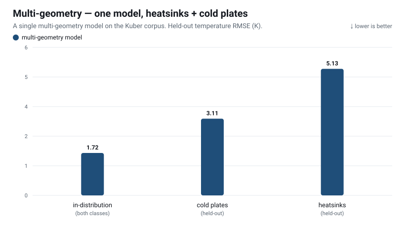

| held-out class | Temp RMSE (K) ↓ | mean nRMSE ↓ |
|---|:---:|:---:|
| cold plates | 3.11 | 0.028 |
| heatsinks | 5.13 | 0.145 |
| in-distribution (both) | 1.72 | 0.027 |

These numbers are on our self-generated corpus and are **not comparable** to the SIMSHIFT numbers above (different training set and test distribution). The cold-plate result generalizes to held-out cases with almost no degradation (mean nRMSE 0.028 vs 0.027 in-distribution). Cold plates are currently straight-channel; topology diversity is on the roadmap. Machine-readable: [`results/multigeo.json`](results/multigeo.json).

### Ground truth vs. prediction

What the surrogate actually produces — the solid device geometry plus the fluid field, CFD ground truth beside Kuber's prediction, for a heatsink and a cold plate (temperature or velocity). [**Open the interactive 3D viewer →**](https://claude.ai/code/artifact/18bccea0-365d-457d-b545-a6c66d0eee3d)

[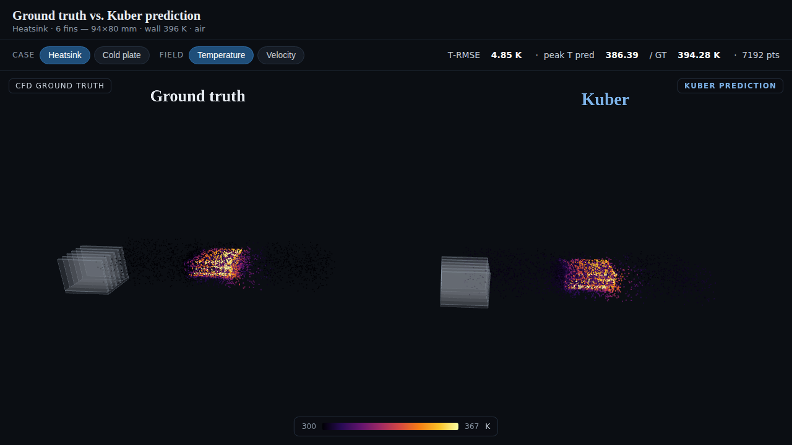](https://claude.ai/code/artifact/18bccea0-365d-457d-b545-a6c66d0eee3d)

## Dataset

The Data Engine's output: a self-generated OpenFOAM CHT corpus — **0 cases from SIMSHIFT or any licensed source**.

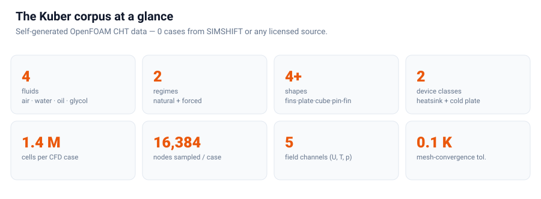

Pipeline ([`datagen/`](datagen)): parametric generator → STL → `blockMesh` + `snappyHexMesh` (+ prism layers) → solve → `.npz`, resumable, gated by convergence + a physics filter. A 6-case sample (3 heatsinks + 3 cold plates) is in [`data_sample/`](data_sample); the full contract is in [`docs/DATASET.md`](docs/DATASET.md).

Example cases — the OpenFOAM ground-truth fields the surrogate learns (temperature + velocity magnitude):

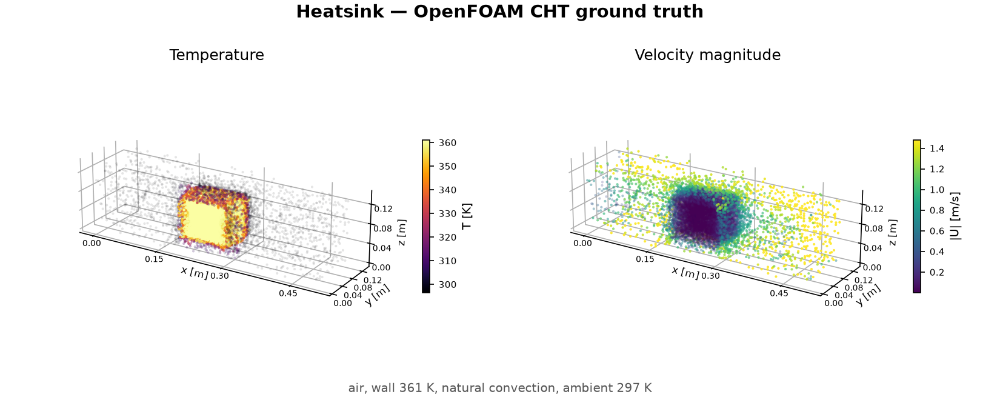
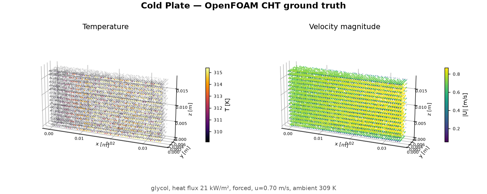

**Fidelity is verified, not assumed** — prism layers recover the near-wall hot spot to within 0.1 K of a fine mesh at ~2.7× lower cost:

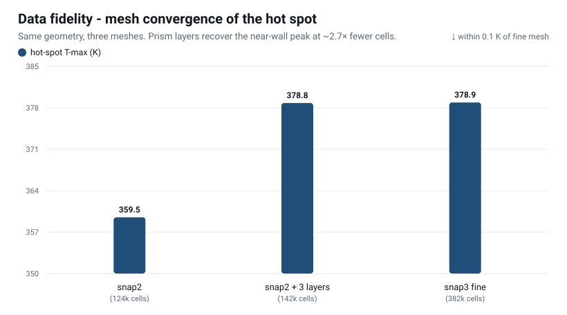

## Installation

```bash
git clone https://github.com/ShubhJain007/Kuber.git
cd Kuber
python -m venv .venv && source .venv/bin/activate     # or use conda
pip install -r requirements.txt
```

The model core is **GeoTransolver** from NVIDIA PhysicsNeMo (`physicsnemo.experimental.models.geotransolver`) — install per its [instructions](https://github.com/NVIDIA/physicsnemo); a CUDA GPU is recommended for training and required for the multiscale ball-query core. **Data generation** additionally needs [OpenFOAM](https://www.openfoam.com/) (v2306+) on your `PATH`; the model, evaluation, and the data sample work without it.

## Quickstart

**Try it in your browser, no install:** [](https://colab.research.google.com/github/ShubhJain007/Kuber/blob/main/notebooks/quickstart.ipynb) — loads a real CHT case and visualizes it on CPU.

```bash
# 1. Peek at a sample case (no OpenFOAM, no GPU needed)
python -c "import numpy as np, os; d=np.load('data_sample/'+sorted(os.listdir('data_sample'))[0]); \
           print({k:getattr(d[k],'shape',None) for k in d.files})"

# 2. Evaluate a trained checkpoint (geometry mode + conditioning are read from it)
python -m kuber.train_simshift \
    --data <simshift_npz_dir> --splits <splits.json> --difficulty medium \
    --eval_only <model.pt>

# 3. Reproduce the numerical-stability proof
python -m kuber.edge_proof \
    --ckpt <model.pt> --data <simshift_npz_dir> --splits <splits.json> --difficulty medium

# 4. Train the production model (full-geometry / surface input)
python -m kuber.train_simshift \
    --data <npz_dir> --splits <splits.json> --difficulty medium --geom_mode surface
```

`--geom_mode {none,sdf,dsdf,surface}` selects the geometry representation (`surface` is the reported production model); `--refine` adds the generative PDE-Refiner head. See `python -m kuber.train_simshift --help`.

## The model

**SurfaceGeoTransolver** = a GeoTransolver physics-attention core (256 hidden × 12 layers) + a surface-geometry encoder (surface point cloud + normals → geometry tokens → per-node descriptor via kNN cross-attention). The surface input is what makes it **geometry-general** — it works on arbitrary CAD, with no analytic SDF required. An optional **PDE-Refiner** head restores high-frequency content and yields an uncertainty estimate (the seed of the Uncertainty pillar). Architecture card: [`docs/MODEL.md`](docs/MODEL.md).

## Roadmap

The three shipping pillars are the foundation. Kuber becomes a *design tool* — and a broader Engineering-AI framework — with:

1. **Connectors — bring your own geometry.** Native ingest of STEP / STL / CAD and OpenFOAM cases, plus export back into standard thermal workflows, exposed as a Python API + CLI. The surface-cloud interface already accepts arbitrary meshes; connectors make it turnkey.
2. **Bayesian uncertainty predictor.** Calibrated, per-node predictive uncertainty so an engineer knows *where* to trust the surrogate and where to fall back to CFD. Builds on the PDE-Refiner sampling, extended with deep-ensemble / variational / conformal calibration — and it feeds active learning.
3. **Agentic geometry optimization.** A closed design loop: an agent proposes geometry edits (fin pitch/height, channel routing, pin layout), the surrogate scores thermal + pressure-drop objectives in milliseconds, and the agent searches the design space — with CFD-in-the-loop only to verify the winner.
4. **More CHT domains and depth.** Additional device classes and topologies (serpentine, pin-fin, parallel cold plates; immersion; vapor chambers); other conjugate-heat-transfer domains beyond electronics cooling (heat exchangers, battery thermal, power modules, turbomachinery cooling); active learning that targets the data engine at high-uncertainty cases; a hosted leaderboard with a sealed test set; and released checkpoints.

Contributions to any of these are welcome — see [`CONTRIBUTING.md`](CONTRIBUTING.md).

## Repository layout

```
Kuber/
├── kuber/                     # the model + harness (Python package)
│   ├── surface_geotransolver.py   # SurfaceGeoTransolver (surface branch + GeoTransolver core)
│   ├── surface_model.py           # surface encoder + local cross-attention
│   ├── surface_geom.py            # analytic surface point cloud + normals from parameters
│   ├── pde_refiner.py             # PDE-Refiner (generative refinement head)
│   ├── train_simshift.py          # training + eval + all geometry modes + data loading
│   └── edge_proof.py              # gradient-fidelity / no-explosion stability harness
├── datagen/                   # OpenFOAM buoyantSimpleFoam CHT pipeline (heatsink + cold plate)
├── data_sample/              # 6 example cases (.npz) + a sample split
├── results/                  # machine-readable results (JSON + CSV)
├── notebooks/                # Colab quickstart (loads a case, no GPU/weights)
├── assets/                   # result figures (SVG) + their generator
├── checkpoints/             # how to obtain trained weights
├── docs/                    # RESULTS, DATASET, MODEL, BENCHMARK
└── scripts/                 # convenience wrappers
```

## Reproducing our numbers

Every number above is produced by the code here (SIMSHIFT data + splits from the [official repo](https://github.com/psetinek/simshift); the corpus regenerated with `datagen/`):

```bash
# leaderboard (production model)
python -m kuber.train_simshift --data <simshift> --splits <splits> --difficulty medium --geom_mode surface
# value-of-data: pretrain on the corpus (reduced "transfer" conditioning), then fine-tune
python -m kuber.train_simshift --data <corpus> --splits <corpus_splits> --difficulty medium \
    --geom_mode surface --drop_geom_scalars --out pretrain/
python -m kuber.train_simshift --data <simshift> --splits <splits> --difficulty medium \
    --geom_mode surface --drop_geom_scalars --init_from pretrain/<pretrained.pt>
# numerical-stability proof
python -m kuber.edge_proof --ckpt <model.pt> --data <simshift> --splits <splits> --difficulty medium
```

Regenerate the figures with `python assets/make_figures.py`.

## License

Kuber is released under the **[PolyForm Noncommercial License 1.0.0](LICENSE)** — free for research, education, evaluation, and any other noncommercial use. **Commercial use requires a separate license** — contact the Kuber.ai team. This mirrors how open Engineering-AI frameworks are typically licensed: open for the community, with a separate commercial track.

## Citing

```bibtex
@software{kuber2026,
  title  = {Kuber: An Open Framework for Engineering AI},
  author = {Jain, Shubh},
  year   = {2026},
  url    = {https://github.com/ShubhJain007/Kuber}
}
```

## Acknowledgements

Kuber builds on **GeoTransolver / PhysicsNeMo** (NVIDIA, Apache-2.0, used as a dependency), **Transolver** (Wu et al., 2024), **AB-UPT** (Alkin et al., 2025), **SIMSHIFT** (Setinek et al.), and **PDE-Refiner** (Lippe et al., NeurIPS 2023). Full references in [`docs/MODEL.md`](docs/MODEL.md).

<div align="center">
<sub>Built by the Kuber.ai team — an open framework for conjugate–heat-transfer AI.</sub>
</div>
