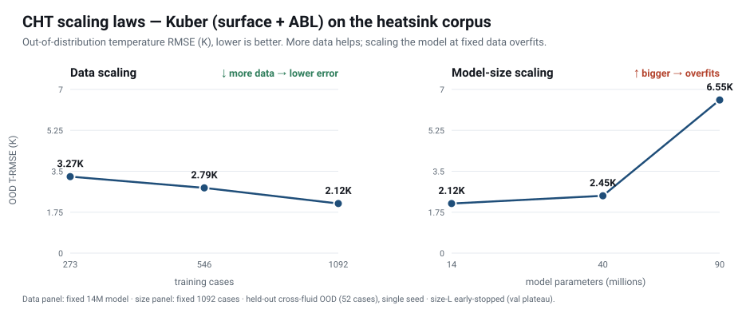

# Scaling laws — conjugate heat transfer

We scale the Kuber model (surface geometry branch + ABL attention — the same architecture that
reaches 11.84 K on SIMSHIFT) along two axes, **training data** and **model size**, on the generated
heatsink corpus. The metric is out-of-distribution temperature RMSE on a held-out set.



## Data scaling — fixed 14 M model

| training cases | OOD T-RMSE (K) |
|---:|---:|
| 273 | 3.27 |
| 546 | 2.79 |
| 1 092 | **2.12** |

Error falls **monotonically** as the corpus grows: the model is data-hungry and keeps improving with
more simulations.

## Model-size scaling — fixed 1 092 cases

| parameters | OOD T-RMSE (K) |
|---:|---:|
| 14 M | **2.12** |
| 40 M | 2.45 |
| 90 M | 6.55 |

Error **rises** as the network grows at fixed data: the larger models overfit the corpus and
generalize worse out of distribution.

## Takeaway

This regime is **data-limited, not capacity-limited** — more data helps, more parameters (at fixed
data) hurt. The highest-leverage investment is therefore a **larger, more diverse CHT corpus, not a
bigger network**. It is the clearest quantitative statement of why the data engine is the moat.

## Caveats (stated honestly)

- The out-of-distribution set here is a **cross-fluid** hold-out (52 cases) — a milder shift than the
  fin-count/topology shift behind the 11.84 K SIMSHIFT headline, so absolute numbers are lower.
- **Single seed** per point (≈ 1 K run-to-run variance observed): read the *trends* as robust and the
  individual points as approximate.
- The 90 M model early-stopped on a validation plateau (the overfitting signature) and is somewhat
  under-trained; regularization and seeds would sharpen the exact value, not the direction.

## Reproduce

```
python -m src.train_simshift \
  --data <corpus> --splits <watertest_{25,50,100}.json> --difficulty medium \
  --geom_mode surface --n_points 8192 --batch_size 4 --lr 1e-3
# model-size axis: add --n_hidden / --n_layers / --d_surf / --slice_num
# figure: python assets/make_scaling.py  ->  assets/fig_scaling.svg
```
